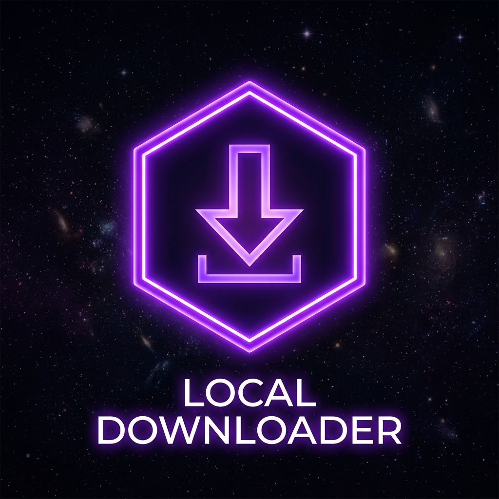

# Local Downloader ⚡



> **Local Downloader** is a premium, lightweight, and ultra-fast media downloader application for Windows. It features a modern, clean dashboard layout inspired by StreamSave, supporting dynamic status checks, theme switcher, proxy support, and multi-platform media retrieval.

---

## ✨ Features

- **🌐 Multi-Platform Support**: Seamlessly download high-definition videos and audios from **YouTube**, **Facebook**, **Instagram**, **TikTok**, and other media hosting platforms.
- **🎨 Premium Dual Theme**: Toggle instantly between a pristine **Light Mode** and a deep **Dark Space Mode**. Your preference is automatically saved locally.
- **⚡ Add-to-Queue UX**: Auto-processes URL links and initiates downloads in your preferred quality preset immediately.
- **⚙️ Advanced Settings**:
  - **Browser Cookies Integration**: Locally import browser cookies (Chrome, Edge, Firefox, Brave) to bypass age/login blocks on platforms like Instagram.
  - **Custom Proxy Configuration**: Route download traffic through SOCKS5 or HTTP proxies to avoid rate limits.
  - **Default Quality Presets**: Pre-select preferred quality formats (1080p, 720p, 480p, MP3) for one-click downloading.
- **🚀 Live Server Statistics**:
  - Displays real-time download speeds.
  - Computes cumulative saved disk space and total downloads log stats.
  - Monitors and displays actual remaining space on the destination disk drive.
- **🛠️ Self-Updating Core Engine**: Upgrade the core downloading engine (`yt-dlp`) with a single click inside the app settings—no command prompt required.
- **📁 File & Folder Integration**: Play video files immediately using your default media player, or highlight them inside Windows File Explorer with a single click.

---

## 📦 Directory Structure

```text
local-downloader/
│
├── .github/workflows/
│   └── build.yml          # GitHub Actions auto-compilation pipeline
│
├── dist/
│   └── LocalDownloader.exe # Compiled standalone Windows application
│
├── static/
│   ├── index.html         # Premium Dashboard Frontend UI
│   ├── style.css          # Dual Theme responsive stylesheets
│   ├── app.js             # GUI and API integration controller
│   └── logo.png           # App branding assets
│
├── main.py                # FastAPI backend server & download manager
├── gui.py                 # pywebview wrapper & desktop window entrypoint
├── build_app.py           # PyInstaller compiler configuration
├── SetupInstaller.bat     # Windows setup installer launcher
├── install.ps1            # Windows installation powershell deployment script
├── config.json            # Local user configurations
├── history.json           # User download log history
└── requirements.txt       # Python package dependencies
```

---

## 🚀 Installation & Usage

You do **not** need Python installed on your PC to run this app. 

### 1. Simple Installation (Windows):
1. Download this repository.
2. Double-click on **`SetupInstaller.bat`**.
3. It will:
   - Move the program files permanently to your Local Programs folder.
   - Create a desktop shortcut named **"Local Downloader"**.
   - Pin a shortcut inside your **Start Menu**.
   - Add the app to Windows Settings, allowing you to uninstall it cleanly via the Windows Control Panel at any time.

---

## 🛠️ Developer Setup & Compiling

If you wish to modify the source code and rebuild the application yourself:

### Prerequisites:
- Python 3.10+
- FFmpeg (for combining audio/video feeds above 720p)

### Local setup:
1. Clone the repository.
2. Install Python packages:
   ```bash
   pip install -r requirements.txt
   ```
3. Compile the standalone executable:
   ```bash
   python build_app.py
   ```
   *The newly compiled executable will be written to `dist/LocalDownloader.exe`.*

---

## ⚙️ CI/CD Auto-Builds (GitHub Actions)

This repository includes a pre-configured GitHub Actions workflow. When you push your code changes to GitHub:
1. GitHub Actions will launch a virtual Windows runner.
2. It compiles the source scripts into a standalone executable.
3. It packages the installation files into a single, clean `.zip` release artifact (`LocalDownloader-Setup.zip`).

---

## 🛡️ Privacy & Security

- **100% Local Processing**: All files, logs, settings, and database configurations remain on your localhost (`127.0.0.1:8000`). No telemetry data or logs are ever transmitted to third-party servers.
- **Zero Admin Elevation**: The installer does not request Administrator permissions, protecting your Windows system files from unauthorized writes.
